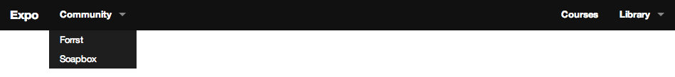

# Foundation Navigation

## Installation

Add this line to your application's Gemfile:

    gem 'foundation-navigation'

And then execute:

    $ bundle

Or install it yourself as:

    $ gem install foundation-navigation

## Usage

### Topbar

See <http://foundation.zurb.com/docs/components/top-bar.html>

#### Example

This Haml snippet

    = topbar(title: 'Expo') do
      - left do
        - dropdown 'Community', 'http://www.zurb.com/expo/community'  do
          - menu_item 'Forrst', 'http://www.forrst.com'
          - menu_item 'Soapbox', 'http://www.zurb.com/soapbox'
      - right do
        - menu_item 'Courses', '#'
        - dropdown 'Library' do
          - menu_item 'Pattern Tap', 'http://patterntap.com'
          - menu_item 'Word', 'http://www.zurb.com/word'
          - menu_item 'Responsive', 'http://www.zurb.com/responsive'

generates the following top-bar

### Methods

#### topbar ####

    = topbar

or with specific options

    = topbar title: 'Example', title_link: 'http://www.example.com', sticky: true

Options:

* __title__: Page Title (Default: empty)
* __title_link__: Link on Title (Default: #)
* __contain_to_grid__: Wraps top-bar in contain-to-grid div (Default: false)
* __fixed__: Wraps top-bar in fixed div (Default: false)
* __sticky__: Wraps top-bar in sticky div (Default: false)

#### menu_group/left/right ####

Helpers to nest menu-item groups and arrange them within the topbar.

    = topbar do
      - menu_group do             # <ul>...</ul>
      # or
      - left do                   # <ul class='left'>...</ul>
        ...
      - right do                  # <ul class='right'>...</ul>
        ...

#### divider ####

Adds a divider element

    = topbar do
      - menu_group do             # <ul>...</ul>
        - divider                 # <li class="divider"></li>
        ...
        - divider                 # <li class="divider"></li>

#### dropdown ####

Groups nested elements and renders them as dropdown box

    = topbar do
      - left do
        - dropdown 'caption' do
          ...

generates the following markup

    ...
    <ul>
      <li class="has-dropdown not-click">
        <a href="#">caption</a>
      </li>
    </ul>
    <ul class="dropdown">
      ...
    </ul>

Options:

* Dropdown caption
* Dropdown link (on the caption, default: '#')

#### menu_item ####

Renders a single link and can be nested in a menu_group or a dropdown.

    = topbar do
      ...
        - menu_item 'Title', '/link'  # <a href='/link'>Title</a>

## Contributing

1. Fork it
2. Create your feature branch (`git checkout -b my-new-feature`)
3. Commit your changes (`git commit -am 'Add some feature'`)
4. Push to the branch (`git push origin my-new-feature`)
5. Create new Pull Request
